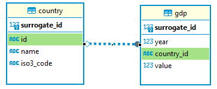

# cw data-engineer-test

This project convers two main functionalities:
- Collects the South-American countries GDP data from the worldbank api, at https://api.worldbank.org/v2/country/ARG;BOL;BRA;CHL;COL;ECU;GUY;PRY;PER;SUR;URY;VEN/indicator/NY.GDP.MKTP.CD?format=json&page=1&per_page=1000, and insert them in a database.
- Queries the GDP database from year 2019 to 2023 and outputs the pivot data as a csv file.


There's a single docker image with the default command to extract the api data.
However this can be changed to execute the querier by modifying the cmd command on docker run, which is shown later at [Defaut Docker](#default-docker). The diagram below shows the tables and relations created for the project.
<p align="left">
  
</p>


## Table of Contents
1. [Project Structure](#project-strucute)
2. [Installation](#installation)
3. [Usage](#usage)
    1. [Local Python](#local-python)
    2. [Docker](#docker)
        1. [Defaut Docker](#default-docker)
        2. [Docker Compose](#docker-compose)


## Project Strucute
```bash
├── app
    ├── alchemy
        ├── models.py
        └── session.py
    ├── database
        ├── log
            ├── extractor.log
            └── output.log
        ├── output.csv
        └── worldbank.sqlite3
    ├── extractor
        ├── extract.py
        ├── logger.py
        └── tools.py
    ├── query
        ├── logger.py
        └── query.py
├── db_tables.png
├── docker-compose.yml
├── Dockerfile
├── LICENSE
├── README.md
└── requirements.txt
```

The app folder contains all the files for the project logic
- alchemy: sqlalchemy models and session manager.
- database: store the persistent data like the worldbank.sqlit3, logs and the pivoted query output as csv.
- extractor: worldbank api extraction logic.
- query: queries the database, pivot it and writes as a csv output located on "database" folder.

Before inserting data in the database, the extractor module first checks:
 - If the database doesn't exists, it will create a fresh one with the models and insert all the api data.
 - If exists, it will check the records quantity in the database and the api
 - If the quantities are the same, there aren't any new data to insert, so the module will end
 - If the quantities are not the same, the module it insert the data.

This reduces the extraction time, because it will only trigger the insertion if the quantities are not the same.


The extractor and query modules function independently, offering the flexibility to obtain output without updating the database, as the query process is faster than database updates or vice versa. However, note that unlike the extraction module, the query module lacks a database integrity check. To address this, new users are instructed to begin with the extraction module first on the [Usage](#usage) section.

## InstallationW

### Prerequisites
- Python (used version: 3.12)
- Docker (used version: 24.0.7)


### Installation Steps
- git clone https://github.com/joaoartursilveira/cw-dataengineer-test.git
- Navigate to the project directory.
- Run the terminal command "python -m venv venv" to create the python virtual environment.
- Run the terminal command "venv\Scripts\activate" to connect to the venv.
- Run the terminal command "pip install -r requirements.txt" to install all dependecies.


## Usage

### Local Python
- Run the terminal command "python -m app.extractor.extract" to extract the worldbank api data.
- Run the terminal command "python -m app.query.query" to create a csv file with the Gdp pivot data on ./app/database folder.


### Docker
- Navigate to the project directory.
- Run the terminal command "docker volume create cloudwalk_volume", this will be the folder that the data will persist.

#### Default Docker
- Run the terminal command "docker build -t cloudwalk-image ." to build the image
- Run the teminal command "docker run -v cloudwalk_volume:/usr/src/cloudwalk/app/database --name extract1 cloudwalk-image" to start a extraction container'
- Run the teminal command "docker run -v cloudwalk_volume:/usr/src/cloudwalk/app/database --name query1 cloudwalk-image python -m app.query.query" to start a querier container
- Check the named volume to interact with the database, output files and logs.

#### Docker Compose
- Run the terminal command "docker-compose build" to create the project image.
- Run the terminal command "docker-compose up" to start the image on each container.
- Check the named volume to interact with the database, output files and logs.